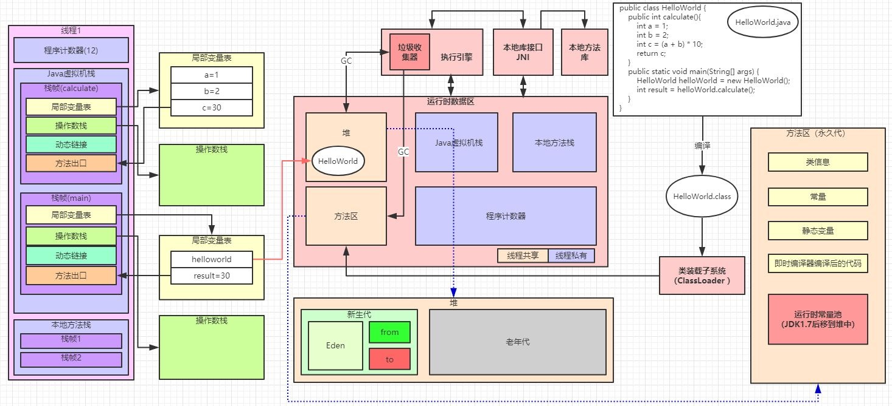
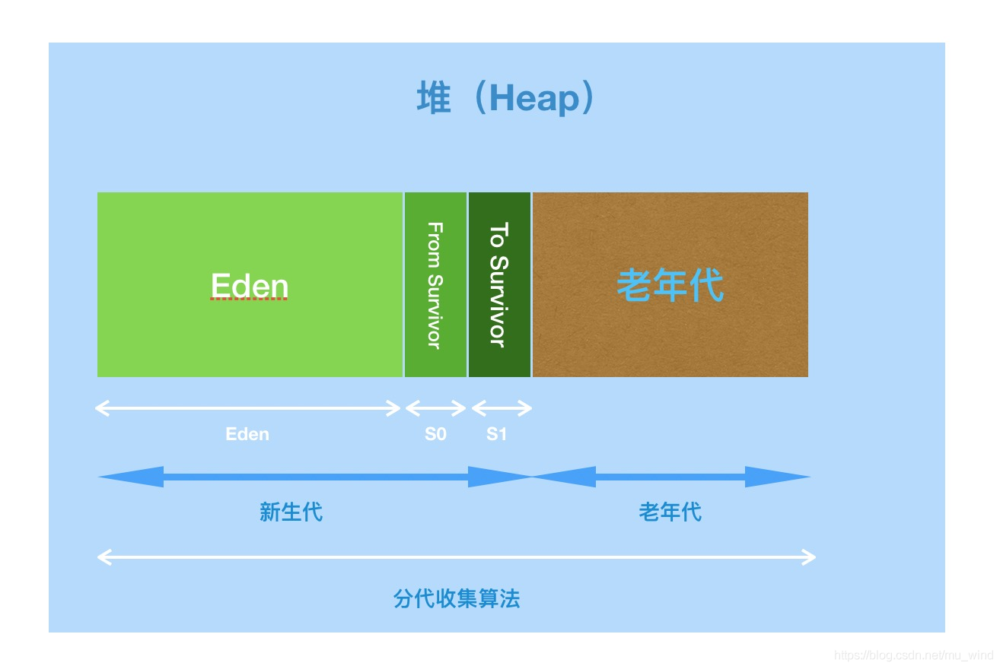

# 结构

# 堆内存(heap)

- 对象实例
- 线程共享
- 可GC
- eden : s0 : s1 : old == 8 : 1 : 1 : 20

# 方法区(method area)
- classLoader加载的类信息
- 常量
- 静态变量
- 线程共享
- 可GC

# 程序计数器(program counter register)
- 记录执行行号
- 线程私有
- 唯一一个不会抛outOfMemory异常的区域

# 虚拟机栈
- 线程私有
- 一个方法一个栈帧，栈顶帧就是当前方法
    > 如果栈帧深度过长，则抛stackoverflow错误，如死循环，或者递归调用斐波那契
- 每个栈帧种包含
    - 局部变量（简单类型或引用地址）
    - 操作数栈（保存执行过程中的变量，常量，运算符，LIFO）
    - 动态链接（指引用地址和对象实例的映射关系）
    - 方法出口（记录方法返回的位置）

# 本地方法栈
- 和虚拟机栈类似，区别是用于执行native方法

# 参见
[JVM结构-腾讯云](https://cloud.tencent.com/developer/article/1698363)
