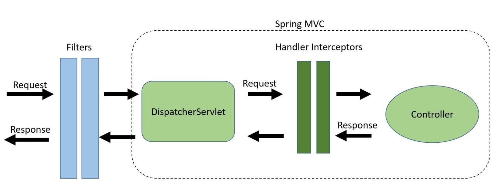

# 介绍



filter是一个类
- 实现了Filter接口
- 重写了doFilter()方法

### tomcat 如何处理请求
```xml
<!-- web.xml, tomcat读取此配置 -->
<web-app>
  <servlet>
    <servlet-name>controlServlet</servlet-name>
    <servlet-class>com.jenkov.butterfly.ControlServlet</servlet-class>
  </servlet>

  <servlet-mapping>
    <servlet-name>controlServlet</servlet-name>
    <url-pattern>*.html</url-pattern>
  </servlet-mapping>
</web-app>   
```

# 场景
由于filter发生在请求进入DispatcherServlet之前，所以很适合做一些通用的事情：
- 验权
- 性能统计
- 图片和数据压缩

# 案例
### 记录日志
```java
@Component
@Order(2)
public class RequestResponseLoggingFilter implements Filter {

    @Override
    public void doFilter(
      ServletRequest request, 
      ServletResponse response, 
      FilterChain chain) throws IOException, ServletException {
 
        HttpServletRequest req = (HttpServletRequest) request;
        HttpServletResponse res = (HttpServletResponse) response;
        LOG.info("Logging Request  {} : {}", req.getMethod(), req.getRequestURI());
        chain.doFilter(request, response);
        LOG.info("Logging Response :{}", res.getContentType());
    }

    // other methods
}
```
这种方式对所有URL都会生效，如果要指定URL，在配置类中
```java
@Bean
public FilterRegistrationBean<RequestResponseLoggingFilter> loggingFilter(){
    FilterRegistrationBean<RequestResponseLoggingFilter> registrationBean = new FilterRegistrationBean<>();
        
    registrationBean.setFilter(new RequestResponseLoggingFilter());
    registrationBean.addUrlPatterns("/users/*");
    registrationBean.setOrder(2);
        
    return registrationBean;    
}
```
或者直接给filter类加注解
```java
@WebFilter(urlPatterns = "/users/*", filterName = "loggingFilter")
```

# 参见
- [web.xml配置](https://segmentfault.com/a/1190000011404088)
- [filter的使用 - baeldung](https://www.baeldung.com/spring-boot-add-filter)