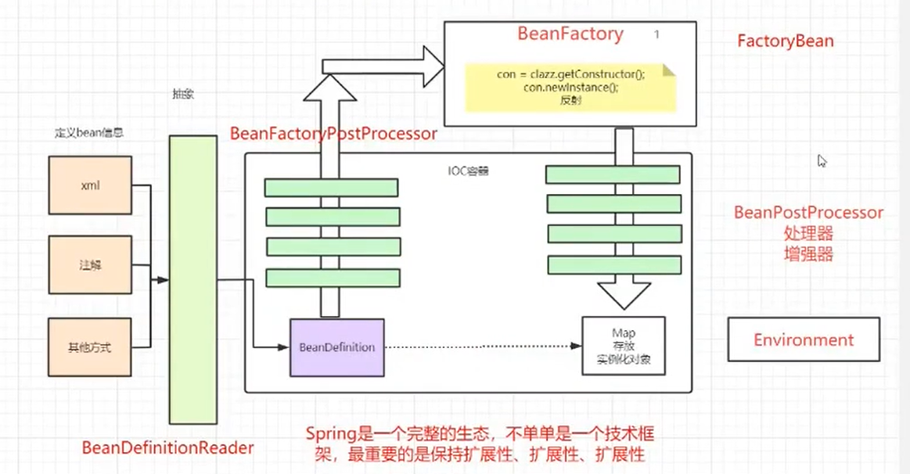
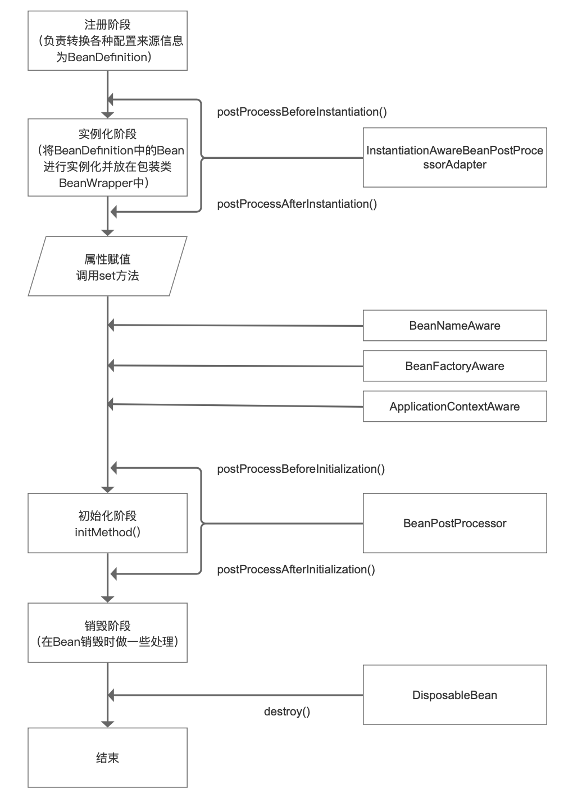

# 介绍


### IOC
控制反转指由Spring容器管理对象(Bean)的初始化和配置

在Spring中，Bean容器抽象为 ApplicationContext接口，负责
- 初始化bean
- 配置和装配bean
- 管理bean的生命周期

Spring提供了几个ApplicationContext的实现类：
- ClassPathXmlApplicationContext (独立应用)
- FileSystemXmlApplicationContext (独立应用)
- WebApplicationContext(web应用)


使用配置文件声明容器
```java
ApplicationContext context = new ClassPathXmlApplicationContext("applicationContext.xml");
```
使用spring boot java配置声明容器
```java
@Configuration
public class MyConfigration {
    @Bean
    public MyBean myBean() {
        return new MyBean();
    }
}
```

### DI
依赖注入主要有三种方式
- field注入 @Autowire
    > 缺点：不能在容器外使用，依赖了容器，比如单元测试必须依赖容器才能实例化，像是个集成测试
- setter注入
    ```java
    @Autowired
    public void setHelper(Helper helper) {
        this.helper = helper;
    }
    ```
- 构造器注入（会导致循环引用无法初始化，官方推荐）


# Bean
### scope
- singleton默认 全局单例
- prototype 每次线程调用生成一个实例
- request 每个request作用域内的请求生成一个实例
- session 每个session作用域内的请求生成一个实例


### 生命周期

四个阶段
- 实例化 Instantiation `createBeanInstance()`
- 属性赋值 Populate `populateBean()`
- 初始化 Initialization `initializeBean()`
- 销毁 Destruction

多个扩展点
- InstantiationAwareBeanPostProcessor
- Aware
- BeanPostProcessor
- DisposableBean


# 参见
- [spring的依赖注入方式 - segmentfault](https://segmentfault.com/a/1190000040849285)
- [bean的request和session scope - 博客园](https://www.cnblogs.com/MrSi/p/7932218.html)
- [Spring Bean的生命周期](https://www.jianshu.com/p/1dec08d290c1)
- [Spring Bean的生命周期](https://my.oschina.net/u/1019754/blog/5031820)