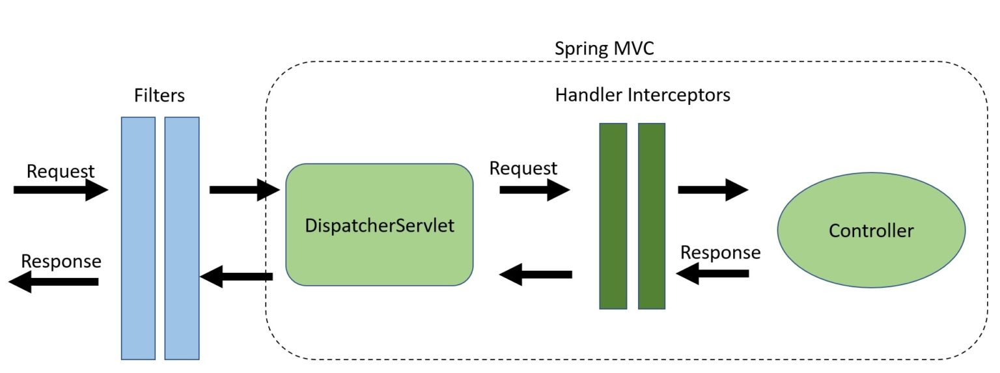

# 介绍


> Filter不知道DispatcherServlet的存在

Spring拦截器是一个类
- 实现了`HandlerInterceptor`接口，或者
- 继承了`HandlerInterceptorAdaptor`类
- 本身是Spring管理的bean，引入其它bean非常简单，这是相比filter的一个优势

包含了三个主要方法
- boolean preHandle()
    > return ture 表示继续执行后续操作
- void postHandle()
- void afterCompletion()

# 场景
由于HandlerInterceptors发生在DispathcerServlet和Controller之间，相比filter适合做一些通用性的事情，拦截器更适合做一些精细化的逻辑：
- controller log打印
- 授权验证
- 操作Spring Context或者Model

# 使用
依赖
```xml
<dependency>
    <groupId>org.springframework</groupId>
    <artifactId>spring-web</artifactId>
    <version>5.3.13</version>
</dependency>
```

# 案例
### 统计接口耗时
```java
public class LogCostInterceptor implements HandlerInterceptor {
    static final TreadLocal<long> start = new ThreadLocal<>();
    @Override
    public boolean preHandle(HttpServletRequest httpServletRequest, HttpServletResponse httpServletResponse, Object o) throws Exception {
        start.set(System.currentTimeMillis());
        return true;
    }
 
    @Override
    public void postHandle(HttpServletRequest httpServletRequest, HttpServletResponse httpServletResponse, Object o, ModelAndView modelAndView) throws Exception {
        System.out.println("Interceptor cost="+(System.currentTimeMillis()-start.get()));
    }
 
    @Override
    public void afterCompletion(HttpServletRequest httpServletRequest, HttpServletResponse httpServletResponse, Object o, Exception e) throws Exception {
    }
}
```
注册拦截器
```java
@Configuration
public class InterceptorConfig extends WebMvcConfigurerAdapter {
 
    @Override
    public void addInterceptors(InterceptorRegistry registry) {
        registry.addInterceptor(new LogCostInterceptor()).addPathPatterns("/**");
        super.addInterceptors(registry);
    }
}
```


# 参见
- [Filter 和 Inteceptors - baeldung](https://www.baeldung.com/spring-mvc-handlerinterceptor-vs-filter)
- [拦截器与过滤器 - 博客园](https://www.cnblogs.com/paddix/p/8365558.html)