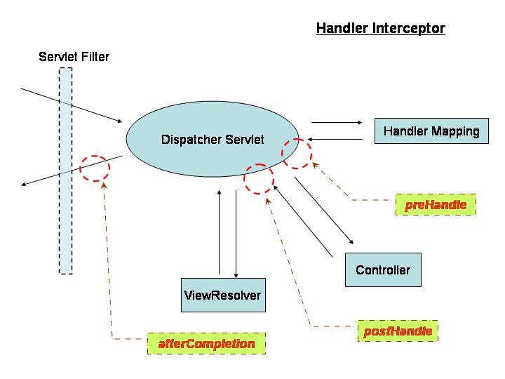

# 介绍

> Filter不知道DispatcherServlet的存在

Spring拦截器是一个类
- 实现了`HandlerInterceptor`接口，或者
- 继承了`HandlerInterceptorAdaptor`类
- 本身是Spring管理的bean，引入其它bean非常简单，这是相比filter的一个优势

包含了三个主要方法
- boolean preHandle()
    > return ture 表示继续执行后续操作
- void postHandle()
- void afterCompletion()

# 使用
依赖
```xml
<dependency>
    <groupId>org.springframework</groupId>
    <artifactId>spring-web</artifactId>
    <version>5.3.13</version>
</dependency>
```

# 案例
### 自定义log


