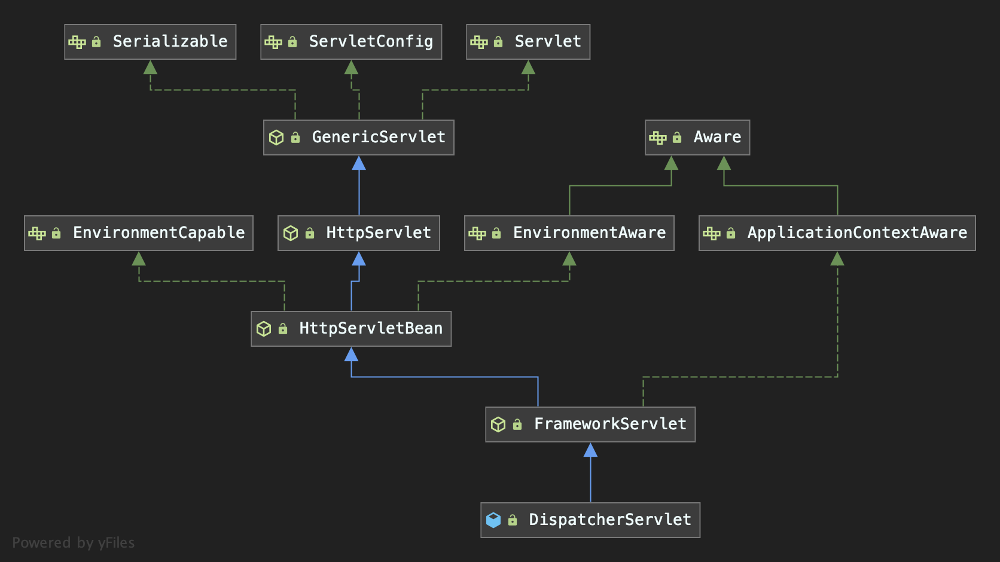

# 介绍
### 渊源
- OSI七层模型
    OSI七层网络模型 | TCP/IP四层概念模型 | 网络协议
    -- | -- | -- 
    应用层(Application) | 应用层 | HTTP 
    表示层(Presentation) | 应用层 | ASCII 
    会话层(Session) | 应用层 | Socket 
    传输层(Transport) | 传输层 | TCP 
    网络层(Network) | 网络层 | IP
    数据链路层(Data Link) | 数据链路层 | - 
    物理层(Physical) | 物理层 | -
- servlet是一个接口 javax.servlet.Servlet，它的各种实现用来处理各种应用层协议
- 最初Spring使用web.xml来配置servlet
- 后来Spring MVC实现了servlet     ？？？？？？
- 后来Spring boot自动装配     ？？？？？

### 目的
Spring MVC 的目的是帮助开发者摆脱一些重复枯燥的工作，比如
- 将一个HTTP请求映射到一个处理它的方法上
- 将一个HTTP请求的请求头和请求体转化为DTO或领域对象
- model-view-controller之间的交互
- 将DTO、领域对象等包装成一个HTTP响应

### 结构
Spring MVC 处理 HTTP 请求的核心类是 DispatcherServlet

# 参见
- [Spring MVC 工作原理 - AndyChen](https://blog.andycen.com/2020/07/05/Spring-MVC%E5%B7%A5%E4%BD%9C%E5%8E%9F%E7%90%86/)