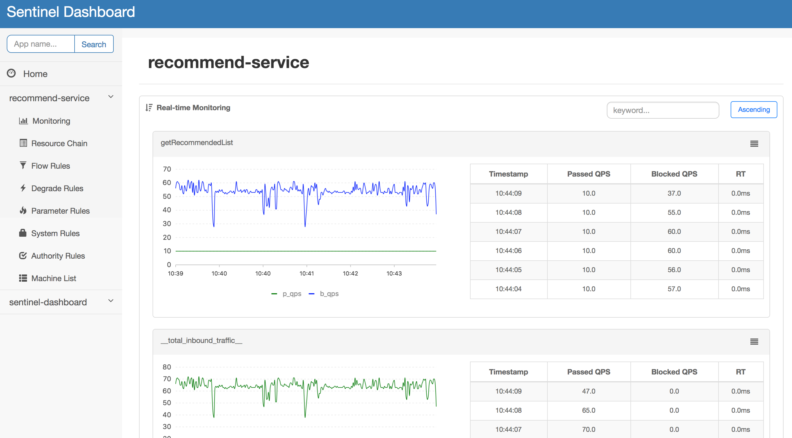
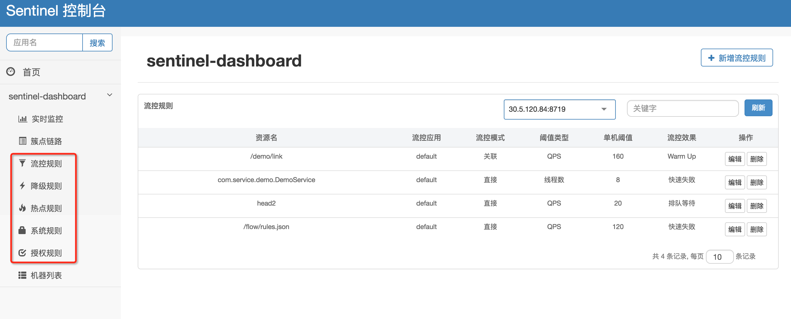

# 介绍
### 构成
- 资源
    - HTTP接口
    - RPC接口
    - 代码片段
    > 一般使用方法签名，URL来标识资源名称
- 规则
    - 流量控制规则
    - 熔断降级规则
    - 系统保护规则
    > 所有规则都可以动态调整

### 功能
- 限流
    - 限流哪条调用链路
    - 运行指标，QPS，线程池，系统负载等
    - 如何限流
        - 直接限流
        - 排队
        - 冷启动（预热，比如需要建立连接池，缓存等，最好QPS缓步增长，属于排队的子集）
- 降级熔断
    - 通过并发线程数限制
    - 通过响应时间限制

### 如何工作
- 支持spring cloud等常见框架，自动定义资源，一般包括接口等
- 对资源进行实时统计和调用链路分析
- 根据预设规则和统计信息，控制流量
- 提供管理后台


# 使用
依赖
```xml
<dependency>
    <groupId>com.alibaba.csp</groupId>
    <artifactId>sentinel-core</artifactId>
    <version>1.8.3</version>
</dependency>
```

定义资源
```java
@SentinelResource("HelloWorld")
public void helloWorld() {
    // 资源中的逻辑
    System.out.println("hello world");
}
```

定义规则
```java
private static void initFlowRules(){
    List<FlowRule> rules = new ArrayList<>();
    FlowRule rule = new FlowRule();
    rule.setResource("HelloWorld");
    rule.setGrade(RuleConstant.FLOW_GRADE_QPS);
    // Set limit QPS to 20.
    rule.setCount(20);
    rules.add(rule);
    FlowRuleManager.loadRules(rules);
}
```

### 控制台
客户端接入控制台需要引入
```xml
<dependency>
    <groupId>com.alibaba.csp</groupId>
    <artifactId>sentinel-transport-simple-http</artifactId>
    <version>1.8.3</version>
</dependency>
```
dashboard

流控规则



# 参见
- [Sentinel介绍](https://sentinelguard.io/zh-cn/docs/introduction.html)
- [快速开始](https://sentinelguard.io/zh-cn/docs/quick-start.html)