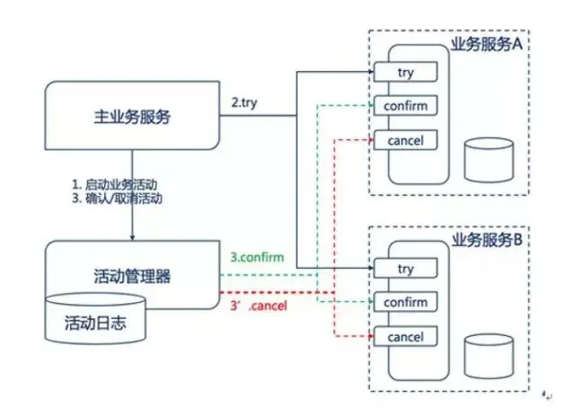
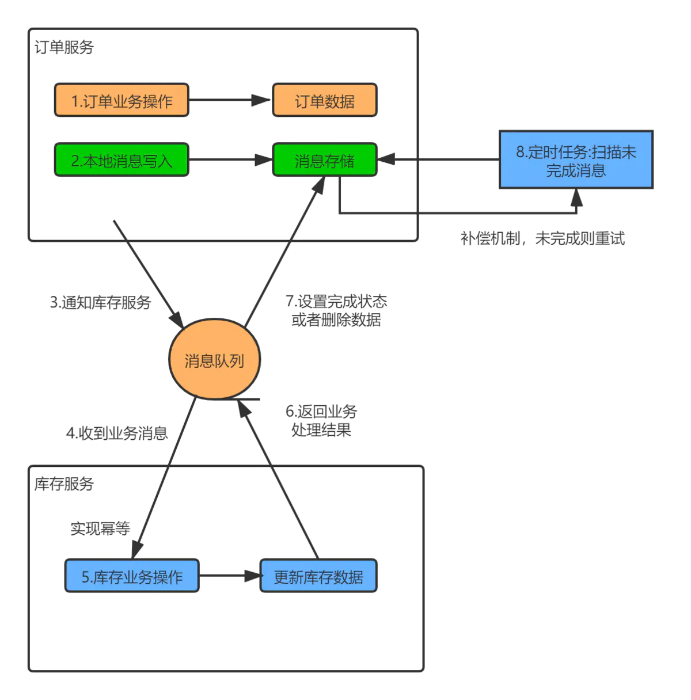
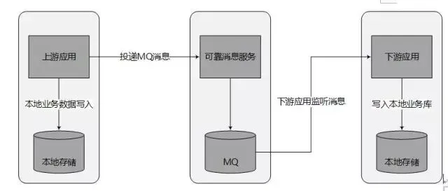
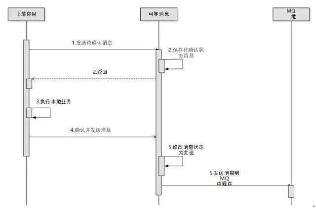
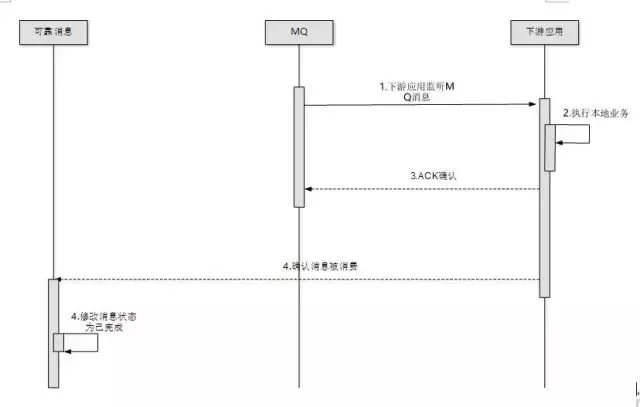

# 数据一致性原理
- CAP不可能三角
- BASE理论
    - Basically Available 基本可用，允许部分损失
        - 响应时间损失
        - 请求降级
    - Soft State 软状态，数据可以用一部分时间不一致
    - Eventually Consistency 最终一致性
    > Base理论是对CAP理论中的C做的补充

# 数据一致性方案
- 重试
- 分布式事务
    - 两阶段提交
    - 三阶段提交
- TCC
- 本地消息表
- 可靠消息最终一致性
- 尽最大努力通知

# 二阶段提交
- Transaction Manager(TM) 事务管理器
- Resource Manager(RM) 资源管理器 关系型数据库或者支持XA接口的组件
- Application(AP) 应用

### 第一阶段，确认
TM给RM发送prepare消息，RM创建并执行本地事务，但是不提交

### 第二阶段，提交
TM通知RM提交或者回滚

### 优缺点
- 引入了RM
- 导致系统吞吐量下降
- 不一定所有数据库都支持XA协议

# TCC

### 第一步，主页务调用所有从业务的try
并在活动管理器记录所有从业务服务

### 第二步，confirm或者cancel
活动管理器通知confirm或者cancel

### 补偿
- confirm失败，回滚所有confirm，并执行cancel
- cancel失败，业务自行提供cancel机制，保证成功

### 案例
订单 -> 积分

- 订单服务先try积分服务，并获得积分服务的confirm和cancel地址
- try成功，订单服务修改自己状态 -> 通知活动管理器 -> 积分confirm
- try失败，订单服务回滚 -> 积分服务定时任务cancel

### 优缺点
- 自己实现confirm和cancel方法，代码量大
- 强一致性，用于涉及钱的业务

# 本地消息表

- 把分布式事务拆解成本地事务
- 本地业务和本地消息放在一个事务中执行
- 另起定时任务扫描未完成消息

### 优缺点
- 简单
- 和业务场景绑定，高耦合
- 本地消息表占用业务资源

# 可靠消息最终一致性

### 第一步，上游应用将本地业务并发送MQ消息，放在同一个本地事务中执行

> 可能出错的地方，上游业务执行，消息发送失败，后续补偿

### 第二步，下游应用消费消息并返回ack，放到一个本地事务中执行

> 可能出错的地方，下游业务执行

### 补偿
- 可靠消息服务检查是否有超时待确认的状态，通知上游服务自检，删除消息或者重发
- 可靠消息服务检查是否有已发送并且超时的消息，通知下游服务自检，重新投递消息
    > 消费方需保持幂等

### 缺点
- 引入了消息队列和可靠消息服务，增加了复杂性
- 适合跨平台技术栈不统一的场景

# 尽最大努力通知
- 上游发MQ
- 最大努力通知服务接收MQ，入库
- 下游消费
> 用于发短信等一致性要求不高场景，MQ可多次重试

# 参见
- [微服务架构下的数据一致性 - 极客时间](https://time.geekbang.org/column/article/3336)
- [面试连环炮之分布式事务和分布式会话 - 知乎](https://zhuanlan.zhihu.com/p/84100494)
- [分布式事务之本地消息表 - 简书](https://www.jianshu.com/p/e31d9ebed201)