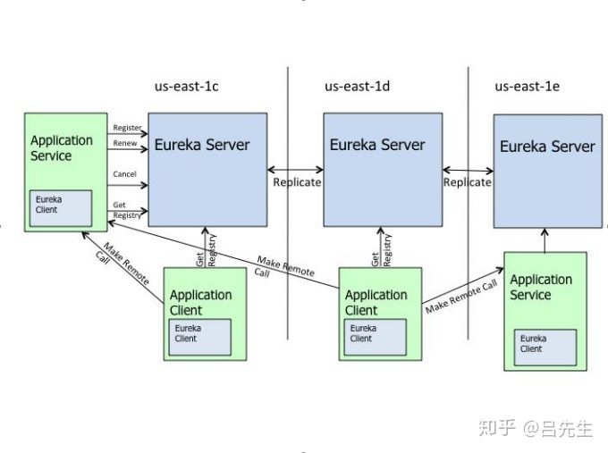

# CAP理论
- Consistency
- Availability
- Partition tolerance

三者不可兼得，只能是CP或者AP

# Eureka

- AP模式（最终一致性）
- 集群中每个Eureka Server都是公平的
- 应用实例仅向一个Eureka Server实例注册，该Server实例后续同步给集群中其它节点
- 默认30s一次上报心跳，如果90s未收到心跳，则Eureka会将该应用实例移除
    > 如果超过85%的业务实例心跳丢失，则Eureka不会剔除任何实例，因为它怀疑网络出了问题，优先保证可用性
- Eureka Client拉取所有实例列表到本地，通过本地Ribbon负载均衡，和Feign发起RPC调用

### 服务非优雅下线导致请求失败怎么办？
- 开启Ribbon的重试模式，不过需要保证接口幂等

### 平滑部署
- 主动调用Eureka 的 shutdown
- 重启服务实例A
- 等待SBA健康检查通过，或者确认Eureka服务列表已经有了服务A，再对服务B同样步骤
> 另外，关闭Eureka ReadOnlyCache，或者设比较短的有效期，让服务列表尽快更新到各个业务实例本地

# 参见
- [Eureka快速下线实例 - 腾讯云](https://cloud.tencent.com/developer/article/1811864)
- [Eureka安全下线 - 阿耶的代码小天才](https://chwwww.github.io/2020/03/31/202004051/)