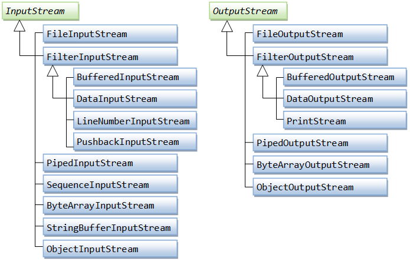
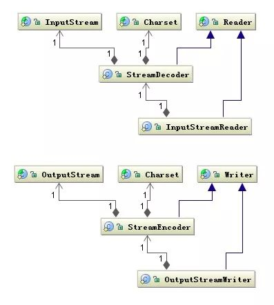
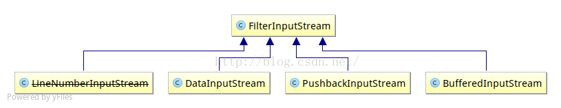

# 介绍

InputStream是一个抽象类，该类最重要的方法是 read()，返回下一个字节，用int(0~255)标示，-1表示读取完毕

```java
public abstract int read() throws IOException;
```

# 字节流和字符流
字符流是应对国际编码，而对字节流做的封装


# FileInputStream
InputStream的子类
```java
// 文件不存在，无权限等会抛出IOException
public void readFile() throws IOException {
    InputStream input = null;
    try {
        input = new FileInputStream("src/readme.txt");
        int n;
        while ((n = input.read()) != -1) { // 利用while同时读取并判断
            System.out.println(n);
        }
    } finally {
        if (input != null) { input.close(); }
    }
}
```
Java7 的 try(resource) 方式
```java
try(InputStream input = new FileInputStream("src/readme.txt")) {
    while (input.read() != -1) {
        System.out.println(n);
    }
}
```
> 实际上并不是编译器添加了自动关闭，而是检查了resource是否实现了java.lang.AutoClosable接口，如果实现了，就加上finally并调用close()方法

### 缓冲
```java
public void readFile() throws IOException {
    try (InputStream input = new FileInputStream("src/readme.txt")) {
        // 定义1000个字节大小的缓冲区:
        byte[] buffer = new byte[1000];
        int n;
        // read buffer 返回读取到的字节数
        while ((n = input.read(buffer)) != -1) { // 读取到缓冲区
            System.out.println("read " + n + " bytes.");
        }
    }
}
```

# FilterInputStream

FilterInputStream 是 InputStream 中的子类，它有一个InputStream的属性，借以实现装饰器模式

### DataInputStream
可以读取Java类型对象
```java
DataInputStream dataInputStream = new DataInputStream(
                            new FileInputStream("binary.data"));

int    aByte   = input.read();
int    anInt   = input.readInt();
float  aFloat  = input.readFloat();
double aDouble = input.readDouble();
//etc.

input.close();
```

### BufferedInputStream
```java
InputStream in = new BufferedInputStream(new FileInputStream("src/readme.txt"));
```
使用和FileInputStream使用缓存一致

# PipedInputStream
线程间通信
```java
// 线程A
pipedOutputStream.write(data.getBytes());
pipedOutputStream.flush();

// 线程B
pipedInputStream.read(data);
System.out.println("pipedInputStream.read "+new String(data));
```

# SequenceInputStream
连续读取多个流
```java
InputStream first = new ByteArrayInputStream("One".getBytes());
InputStream second = new ByteArrayInputStream("Magic".getBytes());
SequenceInputStream sequenceInputStream = new SequenceInputStream(first, second);
StringBuilder stringBuilder = new StringBuilder();
int byteValue;
while ((byteValue = sequenceInputStream.read()) != -1) {
    stringBuilder.append((char) byteValue);
}
assertEquals("OneMagic", stringBuilder.toString());
```
或者使用 Enumeration 来初始化
```java
Vector<InputStream> inputStreams = new Vector<>();
for (String fileName: fileNames) {
    inputStreams.add(new FileInputStream(fileName));
}
sequenceInputStream = new SequenceInputStream(inputStreams.elements());
```
# ByteArrayInputStream
参见上例

# StringBufferInputStream
同ByteArrayInputStream, 区别是ByteArrayInputStream输入源是字节数组，而StringBufferInputStream输入源是String

# ObjectInputStream
同DataInputStream，区别是DataInputStream只能读取Java类型数据，而ObjectInputStream可以读取任何支持序列化和反序列化的类型


# 参考
- [InputStream - 廖雪峰](https://www.liaoxuefeng.com/wiki/1252599548343744/1298069163343905)
- [字节流和字符流 - 腾讯云](https://cloud.tencent.com/developer/article/1401128)
- [PipedInputStream和PipedOutStream记录
 - 知乎](https://zhuanlan.zhihu.com/p/31352578)
- [SequenceInputStream Class in Java - Baeldung](https://www.baeldung.com/java-sequenceinputstream) 
- [DataInputStream vs ObjectInputStream](https://stackoverflow.com/questions/11521027/whats-the-difference-between-dataoutputstream-and-objectoutputstream)