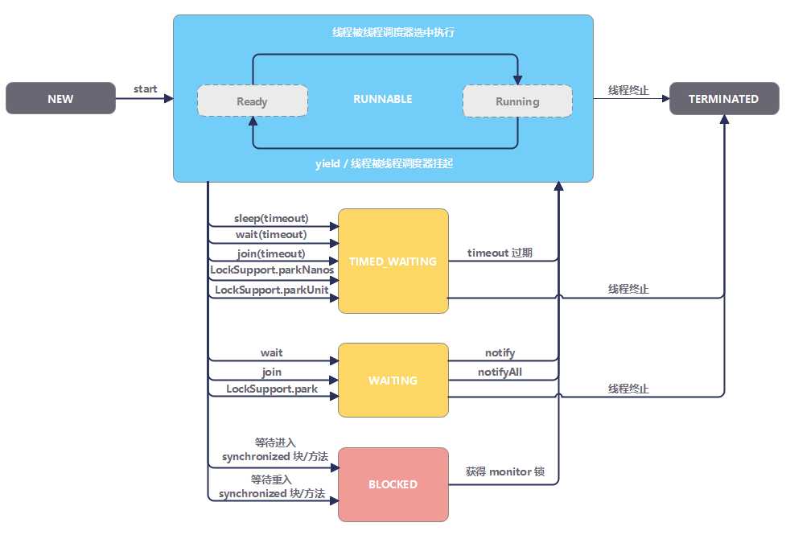

# 创建线程
- 继承 Thread 类
- 实现 Runnable 接口
    > 这种方式更好，因为Java 不支持多重继承，实现接口的方式利于扩展。
- 实现 Callable 接口

```java
// 继承Thread类
class MyThread extends Thread {
    @override
    public void run() { ... }
}

MyThread t = new MyThread();
t.start();
t.interrupt();
```

```java
// 实现Runnable接口, new一个实现Runnable接口的匿名类
new Thread(new Runnable() {
    @override
    public void run() {
        ...
    }
}).start();

// 相当于
new Thread(() -> { ... }).start()
```

```java
// FutureTask 实现了 RunnableFuture 接口
// RunableFuture 接口继承了 Runable 和 Future 接口
// 事实上 FutureTask 是 Future 接口的唯一实现类
FutureTask<String> futureTask = new FutureTask<>(() -> { return "hello world";});
new Thread(futureTask).start();
System.out.println(futureTask.get());
```

# 基本用法
## 线程休眠 Thread.sleep(ms)
```java
new Thread(() -> {
    try {
        // 睡眠1s，让出cpu，不释放锁
        Thread.sleep(1000); 
    } catch (InterruptedException e) {
        // 线程中抛出的异常不会跨线程传播回main线程，所以必须本地处理
        e.printStackTrace();
    }
})
```

## 线程礼让 Thread.yeild()
线程礼让，让出cpu，重新竞争调度，用于长耗时任务手工打断

## 线程终止 t.interrupt()
- 如果线程处于被阻塞状态（例如处于sleep, wait, join 等状态），那么线程将立即退出被阻塞状态，并抛出一个InterruptedException异常。仅此而已。
- 如果线程处于正常活动状态，那么会将该线程的中断标志设置为 true，仅此而已。被设置中断标志的线程将继续正常运行，不受影响。
- 应由线程本地处理中断
```java
new Thread(() -> {
    // 通过 Thread.interrupted 和 interrupt 配合来控制线程终止
    while (!Thread.interrupted()) {
        System.out.println("running");
    }
}).start();
```
- 或者使用标志位来手工处理，作用和interrupted一致
## 守护线程
- 守护线程优先级比较低，用户线程都结束后，守护线程会自动结束
> 用于非关键场景，如 GC 或者日志
```
deamonThread.setDaemon(true);
deamonThread.start();
```

# 线程通信
## SomeObject.wait()
- SomeObject.wait() 释放对象锁，从`running`状态转为`waiting`状态
- SomeObject.notify() 唤醒一个`waiting`状态的线程, 让它拿到对象锁，具体哪一个由JVM决定
- SomeObject.notifyAll() 唤醒所有`waiting`状态的线程，接下来他们要竞争对象锁
> 以上方法都需要在`synchronized`块中使用，典型使用场景是生产者消费者

## threadInstance.join()
- 强制执行当前线程，线程强制运行期间，其他线程无法运行，必须等待此线程完成之后才可以继续执行。
> 使用场景：如果后续逻辑依赖此线程执行结果

## 管道
- PipedOutputStream, PipedInputStream 面向字节
- PipedReader, PipedWriter 面向字符
> 应用场景：导出excel
> - 原方案：查询数据库，生成excel，`下载到本地`，上传cos，`删除本地文件`
> - 管道方案：开新线程，查询数据库，生成excel，`传入到out管道；主线程in管道收数据`，上传cos

# 线程生命周期


# 常见问题
## 可以直接调用 Thread 类的 run 方法么
可以。但是如果直接调用 Thread 的 run 方法，它的行为就会和普通的方法一样。
为了在新的线程中执行我们的代码，必须使用 Thread 的 start 方法。