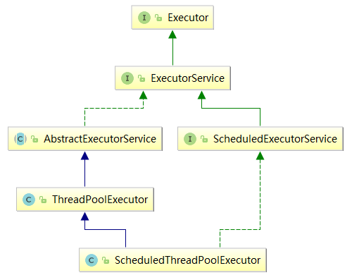
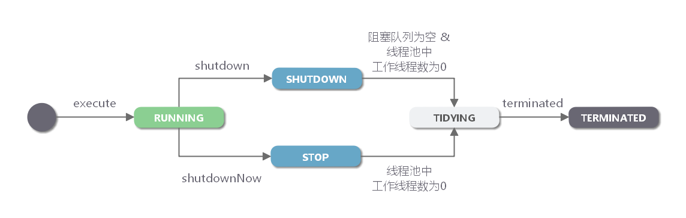

# 继承关系


# ThreadPoolExecutor
```java
public ThreadPoolExecutor(
    int corePoolSize,
    int maximumPoolSize,
    long keepAliveTime, // 空闲非核心线程存活时间
    TimeUnit unit,
    BlockingQueue<Runnable> workQueue,
    ThreadFactory threadFactory, // 可命名线程
    RejectedExecutionHandler handler // 拒绝策略
)
```

workQueue类型
- ArrayBlockingQueue - 有界阻塞队列。
    > 此队列是基于数组的先进先出队列（FIFO）。此队列创建时必须指定大小。
- LinkedBlockingQueue - 无界阻塞队列。
    > 此队列是基于链表的先进先出队列（FIFO）。如果创建时没有指定此队列大小，则默认为 Integer.MAX_VALUE。吞吐量通常要高于 ArrayBlockingQueue。
    > 
    > 使用 LinkedBlockingQueue 意味着： maximumPoolSize 将不起作用，线程池能创建的最大线程数为 corePoolSize，因为任务等待队列是无界队列。
    >
    > Executors.newFixedThreadPool 使用了这个队列。
- SynchronousQueue - 不会保存提交的任务，而是将直接新建一个线程来执行新来的任务。
    > 每个插入操作必须等到另一个线程调用移除操作，否则插入操作一直处于阻塞状态。
    > 
    > 吞吐量通常要高于 LinkedBlockingQueue。
    >
    > Executors.newCachedThreadPool 使用了这个队列。
- PriorityBlockingQueue - 具有优先级的无界阻塞队列。

# 常用方法
- excute
    > 无返回值
    >
    > 是否创建线程判断顺序： corePoolSize => workQueue => maximumPoolSize
- submit
    > 有返回值
- shutdown
    > 关闭线程池，正在执行的线程和等待任务，可以继续执行完毕。但不接收新任务
- awaitTermination
    > 阻塞主线程，直到线程池中的任务执行完毕。常在shutdown之后组合使用，用于关闭线程池。
    ```java
        try {  
            // 向学生传达“问题解答完毕后请举手示意！”  
            pool.shutdown();  
    
            // 向学生传达“XX分之内解答不完的问题全部带回去作为课后作业！”后老师等待学生答题  
            // (所有的任务都结束的时候，返回TRUE)  
            if(!pool.awaitTermination(awaitTime, TimeUnit.MILLISECONDS)){  
                // 超时的时候向线程池中所有的线程发出中断(interrupted)。  
                pool.shutdownNow();  
            }  
        } catch (InterruptedException e) {  
            // awaitTermination方法被中断的时候也中止线程池中全部的线程的执行。  
            System.out.println("awaitTermination interrupted: " + e);  
            pool.shutdownNow();  
        }  
    ```

# 线程池生命周期


# Executors
- newSingleThreadExecutor
    > 顺序执行,LinkedBlockingQueue
- newFixedThreadPool
    > 固定大小，核心线程不会回收，LinkedBlockingQueue, 等待队列无限大
- newCachedThreadPool
    > 线程池没有限制大小，小心并发数
- newScheduleThreadPool
    > 线程池没有限制大小
- newWorkStealingPool
    > 内部ForkJoinPool, 利用 Work-Stealing (opens new window)算法，并行地处理任务，不保证处理顺序。
    >
    > ForkJoinPool使用分治思想，用于解决大数据量的计算问题。使用ForkJoinPool需override RecursiveAction(无返回值) 或者 RecursiveTask(有返回值)
    >
    > ParallelStream底层用的是ForkJoinPool

# 常见问题
### 线程数量
- cpu密集型，n+1
- io密集型，2n

### 建议使用有界阻塞队列
小心OOM

### 重要任务应该自定义拒绝策略
使用有界队列，当任务过多时，线程池会触发执行拒绝策略，线程池默认的拒绝策略会 throw RejectedExecutionException 这是个运行时异常，对于运行时异常编译器并不强制 catch 它，所以开发人员很容易忽略。因此默认拒绝策略要慎重使用。如果线程池处理的任务非常重要，建议自定义自己的拒绝策略；并且在实际工作中，自定义的拒绝策略往往和降级策略配合使用。
> 常见的运行时异常：
> - ClassCastException
> - IndexOutOfBoundsException
> - NullPointerException