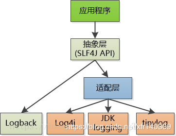

# Spring

### `@Autowired` vs `@Resource`
注解 | 默认注入方式 | 引入包 | 用法
-- | -- | -- | --
`@Autowired` | 按类型 | `org.springframework.beans.factory.annotation.Autowired` | //按名称注入 <br>@Autowired <br>@Qualifier("userDao")
`@Resource` | 优先按名称、其次按类型 | `javax.annotation.Resource` | // 指定名称 <br>@Resource(name="personServiceImpl2") <br>private PersonService service2;

### `@Component`
Annotation | Meaning
-- | --
@Component | generic stereotype for any Spring-managed component
@Repository | stereotype for persistence layer  
@Service | stereotype for service layer   
@Controller | stereotype for presentation layer (spring-mvc) 
> `@Service`, `@Controller`, `@Repository` = {`@Component` + some more special functionality}

### `@RestController`
在`@controller`注解中，返回的是字符串，或者是字符串匹配的模板名称，即直接渲染视图，与html页面配合使用的，

```java
@Controller
@RequestMapping("/user")
public class UserController {
    @GetMapping("")
    public String getUser(Model model) throws IOException {

        model.addAttribute("name",bob);
        model.addAttribute("sex",boy);
        return "user";//user是模板名
    }
}
```
```html
<html>
<body>
    <div>
        <p>"${name}"</p>
        <p>"${sex}"</p>
    </div>
</body>
</html>
```
如果想返回json，则需要配合`@ResponseBody`注解
```java
@Controller
@RequestMapping("/user")
public class UserController {

    @Autowired
    private UserService userService;
    
    @GetMapping("")
    @ResponseBody
    public User getUser() {
        User user = userService.getUser();
        return user;
    }
}
```
而`@RestController` = `@Controller` + `@Responsebody`

```nginx
upstream web-server { 
    ip_hash; 
    server ip1; 
    server ip2; 
} 
```

### `@ExceptionHandler`
`@ExceptionHandler`可以使用在任何用@Controller注解修饰的类中，设置出现某种异常的时候执行，具体代码如下：
```java 
import org.springframework.web.bind.annotation.ExceptionHandler;
import org.springframework.web.bind.annotation.RequestMapping;
import org.springframework.web.bind.annotation.RestController;
import org.springframework.web.context.request.WebRequest;
 
@RestController
public class TestController {
	@RequestMapping(value = "/")
	public String hello() {
		throw new RuntimeException();
	}
 
	@ExceptionHandler(value = { RuntimeException.class })
	public String exception(Exception e, WebRequest webRequest) {
		return "出现异常了，在本类处理";
	}
}
```

### `@ControllerAdvice`
`@ControllerAdvice`是一个特殊的`@Component`，用于标识一个类，这个类中被以下三种注解标识的方法：`@ExceptionHandler`，`@InitBinder`，`@ModelAttribute`，将作用于所有的`@Controller`类的接口上。
```java
import org.springframework.web.bind.annotation.ExceptionHandler;
import org.springframework.web.bind.annotation.RestControllerAdvice;
 
@RestControllerAdvice
public class DefaultExceptionHandlerAdvice {
	@ExceptionHandler(value = { Exception.class })
	public String exception() {
		return "出异常了，全局异常处理";
	}
}
```
> @RestControllerAdvice = @ControllerAdvice + @ResponseBody


# lombok
Lombok不是通过字节码改写来实现的。它主要是用编译器内支持的annotation processing，直接操纵抽象语法树（AST），根据需要添加新节点。
- `@Data`：注解在类上；提供类所有属性的 getting 和 setting 方法，此外还提供了equals、canEqual、hashCode、toString 方法
- `@Setter`：注解在属性上；为属性提供 setting 方法
- `@Getter`：注解在属性上；为属性提供 getting 方法
- `@SneakyThrows`：无需在签名处显式抛出异常
- `@Log4j`：注解在类上；为类提供一个 属性名为log 的 log4j 日志对像
- `@Slf4j`: slf4j不是一个真正的日志实现，而是一个抽象层（ abstraction layer），它允许你在后台使用任意一个日志类库。
- `@NoArgsConstructor`：注解在类上；为类提供一个无参的构造方法
- `@AllArgsConstructor`：注解在类上；为类提供一个全参的构造方法

### @Slf4j
`@Slf4j` Creates the logger with following statement:
```java
private static final org.slf4j.Logger log = org.slf4j.LoggerFactory.getLogger(LogExample.class);
```
> Spring Boot 包含 logback的依赖。`@Slf4j`实际使用的是logback作为日志实现类。所以需要`logback-spring.xml`配置文件

**理解**：首先slf4j可以理解为规则的制定者，是一个抽象层，定义了日志相关的接口。log4j,logback,JDK Logging都是slf4j的实现层，只是出处不同，当然使用起来也就各有千秋，这里放一张网上的图更明了的解释了他们之间的关系：

可以看到logback是直接实现的slf4j，而其他的中间还有一个适配层，至于原因也很简单，因为logback和slf4j的作者是一个人。
