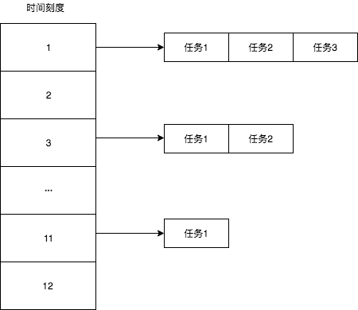
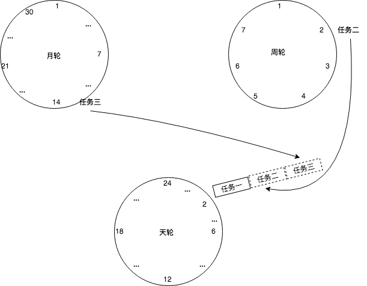

# 介绍
时间轮用于调度任务，crontab 和 netty 中皆有借用时间轮的方法

时间轮需要具备以下四个基础功能
- 加入任务
- 执行任务
- 删除任务
- 前进

# 数据结构

- 外层 数组或循环链表
- 内层 链表

# 分层
为了解决槽位太多和循环任务的问题，可以使用分层

# 参见
- [时间轮 - 腾讯](https://cloud.tencent.com/developer/article/1815722)