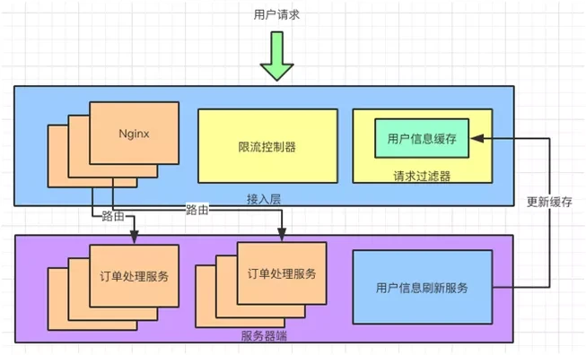

# 场景
100件库存商品，10000个用户购买，如何保证库存安全
- 不多发
- 不少发

# 逻辑
- 下单
- 预占库存（加入购物车，选择下单才预占）
- 支付
- 支付成功减库存
- 取消订单
- 回退库存


# 需求
- 系统怎么扛住高并发
- 防止超卖
- 防止恶意软件刷单秒杀
- 订单长时间没有支付，回退库存
- 防止影响到其它业务
- 先来的流量先抢到商品

# 信息收集
- 流量预估
    - 以往信息
    - 预热活动，提前预约等
- 压测，性能收集

# 系统优化
### 全链路负载均衡
dns -> (lvs) -> nginx -> gateway -> server

### 系统隔离
- 请求url带秒杀参数，路由到单独集群

### 限流
- 前端节流
    - 静态商详页，cdn
    - 点击按钮后置灰
    - 验证码
- 服务端限流
    - 利用redis `setex userId expire value`，一段时间内用户只放一次请求进来（网关）
    - 下单的时候读取 redis.get(userId), 读不到则放行
    - 如果流量还是很高，则用令牌桶
        - nginx + lua + redis，读取注册中心实例数，确认桶大小
        

# 业务设计
有问题的`库存扣减`代码，并发导致超卖


解决方案
### 乐观锁
update时带version，但是在高并发场景下，乐观锁一直重试，导致cpu消耗过高，不适合
```sql
update stock set sales = sales + 1, version = version + 1 where id = "1" and version = version
```
### redis库存预热
将库存信息预热到redis中，并按key分桶

### 回退库存
下单未支付，则回退库存，用延迟队列，下单时将订单信息放入MQ，延迟消费，消费时确认是否已支付，否则回退库存

### 下单异步改造
同步下单需要等待，并发量不大可以用，并发量大了客户端和服务端连接不释放，回导致内存耗尽

### 支付异步改造


# 参考
- [怎么设计秒杀系统 - cnblogs](https://www.cnblogs.com/54chensongxia/p/13609148.html)
- [彻底弄懂秒杀系统 - infoQ](https://www.infoq.cn/article/ypqschsrdsk8bv5nhny4)
- [下单流程异步改造](https://developer.huawei.com/consumer/cn/forum/topic/0202681394780120567?fid=0101592429757310384&postId=0302681394780120612)