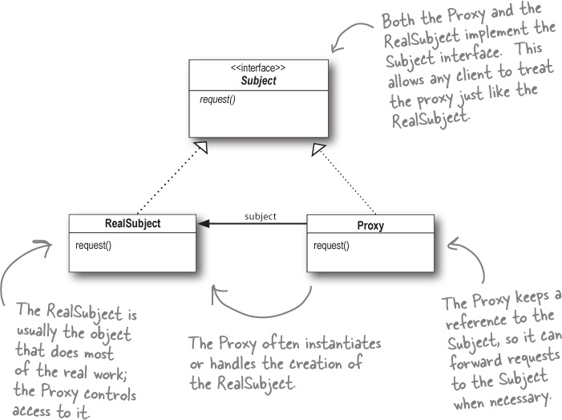

# 介绍
代理模式是一种设计模式，提供了对目标对象额外的访问方式，即通过代理对象访问目标对象，这样可以在不修改原目标对象的前提下，提供额外的功能操作，扩展目标对象的功能。

简言之，代理模式就是设置一个中间代理来控制访问原目标对象，以达到增强原对象的功能和简化访问方式。



# 实现
### 静态代理
```java
package com.proxy;

public class UserDaoProxy implements IUserDao{

    private IUserDao target;
    public UserDaoProxy(IUserDao target) {
        this.target = target;
    }
    
    @Override
    public void save() {
        System.out.println("开启事务");//扩展了额外功能
        target.save();
        System.out.println("提交事务");
    }
}
```

### JDK动态代理
- 通过反射代理方法，比较消耗系统性能，但可以减少代理类的数量，使用更灵活。
- 定义工厂类，输入原对象，输出新对象
- 使用`Proxy.newProxyInstance(classLoader, interface)`获取代理对象
- 实现`InvocationHandler`并Override`invoke(Proxy, method, args)`方法，增强对象

```java
public class ProxyFactory {

    private Object target;// 维护一个目标对象

    public ProxyFactory(Object target) {
        this.target = target;
    }

    // 为目标对象生成代理对象
    public Object getProxyInstance() {
        return Proxy.newProxyInstance(target.getClass().getClassLoader(), target.getClass().getInterfaces(),
                new InvocationHandler() {

                    @Override
                    public Object invoke(Object proxy, Method method, Object[] args) throws Throwable {
                        System.out.println("开启事务");

                        // 执行目标对象方法
                        Object returnValue = method.invoke(target, args);

                        System.out.println("提交事务");
                        return null;
                    }
                });
    }
}
```

### cglib动态代理
- cglib (Code Generation Library )是一个第三方代码生成类库，运行时在内存中动态生成一个子类对象从而实现对目标对象功能的扩展。
- 通过生成类字节码实现代理，比反射稍快，不存在性能问题
- 无须目标对象实现接口，但因为要继承对象，所以不能是final类
- 工厂方法实现`MethodInterceptor`接口
- `new Enhancer()`生成代理对象
- Override `intercept(Object obj, Method method, Object[] args, MethodProxy proxy)`增强方法

```xml
<dependency>
    <groupId>cglib</groupId>
    <artifactId>cglib</artifactId>
    <version>3.2.5</version>
</dependency>
```

```java
package com.cglib;

import java.lang.reflect.Method;

import net.sf.cglib.proxy.Enhancer;
import net.sf.cglib.proxy.MethodInterceptor;
import net.sf.cglib.proxy.MethodProxy;

public class ProxyFactory implements MethodInterceptor{

    private Object target;//维护一个目标对象
    public ProxyFactory(Object target) {
        this.target = target;
    }
    
    //为目标对象生成代理对象
    public Object getProxyInstance() {
        //工具类
        Enhancer en = new Enhancer();
        //设置父类
        en.setSuperclass(target.getClass());
        //设置回调函数
        en.setCallback(this);
        //创建子类对象代理
        return en.create();
    }

    @Override
    public Object intercept(Object obj, Method method, Object[] args, MethodProxy proxy) throws Throwable {
        System.out.println("开启事务");
        // 执行目标对象的方法
        Object returnValue = method.invoke(target, args);
        System.out.println("关闭事务");
        return null;
    }
}
```

# 参见
- [Java三种代理模式 - segmentfault](https://segmentfault.com/a/1190000011291179)