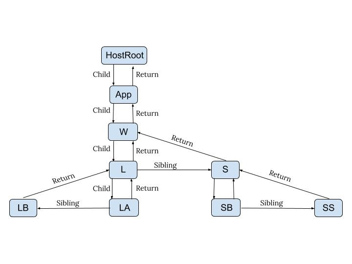

# 介绍
- React Fiber是 React 16提供的新的reconciler算法，之前的reconciler算法是 Stack Reconciler
- 主要目标是扩大适用性，包括动画，布局和手势
    - 任务拆分
    - 任务可中断
    - 可调优先级
- 关键特性
    - 增量渲染（渲染任务拆分，匀到多帧）
    - 更新时能够暂停，终止，复用
    - 给不同类型赋予优先级
    - 并发方面新的基础能力

# 结构
### 老
React在运行时存在三种实例
```
DOM 真实DOM节点
-------
Instances React维护的vDOM tree node
-------
Elements 描述UI长什么样子（type, props）
```
Instances是根据Elements创建的，对组件及DOM节点的抽象表示，vDOM tree维护了组件状态以及组件与DOM树的关系

在首次渲染过程中构建出vDOM tree，后续需要更新时（setState()），diff vDOM tree得到DOM change，并把DOM change应用（patch）到DOM树

Fiber之前的reconciler（被称为Stack reconciler）自顶向下的递归mount/update，无法中断（持续占用主线程），这样主线程上的布局、动画等周期性任务以及交互响应就无法立即得到处理，影响体验

### 新
Fiber解决这个问题的思路是把渲染/更新过程（递归diff）拆分成一系列小任务，每次检查树上的一小部分，做完看是否还有时间继续下一个任务，有的话继续，没有的话把自己挂起，主线程不忙的时候再继续

增量更新需要更多的上下文信息，之前的vDOM tree显然难以满足，所以扩展出了fiber tree（即Fiber上下文的vDOM tree），更新过程就是根据输入数据以及现有的fiber tree构造出新的fiber tree（workInProgress tree）。因此，Instance层新增了这些实例：

```
DOM
    真实DOM节点
-------
effect
    每个workInProgress tree节点上都有一个effect list
    用来存放diff结果
    当前节点更新完毕会向上merge effect list（queue收集diff结果）
- - - -
workInProgress
    workInProgress tree是reconcile过程中从fiber tree建立的当前进度快照，用于断点恢复
- - - -
fiber
    fiber tree与vDOM tree类似，用来描述增量更新所需的上下文信息
-------
Elements
    描述UI长什么样子（type, props）
```
注意：放在虚线上的2层都是临时的结构，仅在更新时有用，日常不持续维护。effect指的就是side effect，包括将要做的DOM change


fiber tree上各节点的主要结构（每个节点称为fiber）如下：
```
// fiber tree节点结构
{
    stateNode,
    child,
    return,
    sibling,
    ...
}
```
P.S.fiber tree实际上是个单链表（Singly Linked List）树结构
```javascript
function App() {    // App
    return (
        <div className="wrapper">    // W
        <div className="list">    // L
            <div className="list_item">List item A</div>    // LA
            <div className="list_item">List item B</div>    // LB
        </div>
        <div className="section">   // S
            <button>Add</button>   // SB
            <span>No. of items: 2</span>   // SS
        </div>
        </div>
    );
}

ReactDOM.render(<App />, document.getElementById('root'));  // HostRoot
```


# 阶段
- reder/reconciliation phase
    - 通过构造workInProgress tree，得出change
    - 内部调用beginWork(), finishWork()等方法，异步
- commit phase
    - 提交change
    - 内部调用commitWork()，同步

### render / reconciliation
以fiber tree为蓝本，把每个fiber作为一个工作单元，自顶向下逐节点构造workInProgress tree（构建中的新fiber tree）

具体过程如下（以组件节点为例）：

1. 如果当前节点不需要更新，直接把子节点clone过来，跳到5；要更新的话打个tag
2. 更新当前节点状态（props, state, context等）
3. 调用shouldComponentUpdate()，false的话，跳到5
4. 调用render()获得新的子节点，并为子节点创建fiber（创建过程会尽量复用现有fiber，子节点增删也发生在这里）
5. 如果没有产生child fiber，该工作单元结束，把effect list归并到return，并把当前节点的sibling作为下一个工作单元；否则把child作为下一个工作单元
6. 如果没有剩余可用时间了，等到下一次主线程空闲时才开始下一个工作单元；否则，立即开始做
7. 如果没有下一个工作单元了（回到了workInProgress tree的根节点），第1阶段结束，进入pendingCommit状态

```javascript
requestIdleCallback(lowPriorityWork);

function lowPriorityWork(deadline) {
    while (deadline.timeRemaining() > 0 && workList.length > 0)
        performUnitOfWork();

    if (workList.length > 0)
        requestIdleCallback(lowPriorityWork);
}
```

### commit
第2阶段直接一口气做完：
1. 处理effect list（包括3种处理：更新DOM树、调用组件生命周期函数以及更新ref等内部状态）
2. 处理结束，第2阶段结束，所有更新都commit到DOM树上了

注意，真的是一口气做完（同步执行，不能喊停）的，这个阶段的实际工作量是比较大的，所以尽量不要在后3个生命周期函数里干重活儿


# fiber对象
- fiber是一个对象，代表一个React元素或者DOM节点
- React使用单链表表示fiber对象间的关系
- fiber对象中有一个return属性，表示父节点，fiber对象完成执行后，返回父节点
```javascript
export type Fiber = {
    // Tag identifying the type of fiber.
    tag: TypeOfWork,
 
    // Unique identifier of this child.
    key: null | string,
 
    // The value of element.type which is used to preserve the identity during
    // reconciliation of this child.
    elementType: any,
 
    // The resolved function/class/ associated with this fiber.
    type: any,
 
    // The local state associated with this fiber.
    stateNode: any,
 
    // Remaining fields belong to Fiber
 
    // The Fiber to return to after finishing processing this one.
    // This is effectively the parent.
    // It is conceptually the same as the return address of a stack frame.
    return: Fiber | null,
 
    // Singly Linked List Tree Structure.
    child: Fiber | null,
    sibling: Fiber | null,
    index: number,
 
    // The ref last used to attach this node.
    ref: null | (((handle: mixed) => void) & {_stringRef: ?string, ...}) | RefObject,
 
    // Input is the data coming into process this fiber. Arguments. Props.
    pendingProps: any, // This type will be more specific once we overload the tag.
    memoizedProps: any, // The props used to create the output.
 
    // A queue of state updates and callbacks.
    updateQueue: mixed,
 
    // The state used to create the output
    memoizedState: any,
 
    mode: TypeOfMode,
 
    // Effect
    effectTag: SideEffectTag,
    subtreeTag: SubtreeTag,
    deletions: Array<Fiber> | null,
 
    // Singly linked list fast path to the next fiber with side-effects.
    nextEffect: Fiber | null,
 
    // The first and last fiber with side-effect within this subtree. This allows
    // us to reuse a slice of the linked list when we reuse the work done within
    // this fiber.
    firstEffect: Fiber | null,
    lastEffect: Fiber | null,
 
    // This is a pooled version of a Fiber. Every fiber that gets updated will
    // eventually have a pair. There are cases when we can clean up pairs to save
    // memory if we need to.
    alternate: Fiber | null,
};
```


# 参见
- [react-fiber-algorithm - velotio](https://www.velotio.com/engineering-blog/react-fiber-algorithm)
- [完全理解react-fiber](http://www.ayqy.net/blog/dive-into-react-fiber/)
- [what is React Fiber - youtube](https://www.youtube.com/watch?v=0ympFIwQFJw&list=PLxRVWC-K96b0ktvhd16l3xA6gncuGP7gJ&index=2)