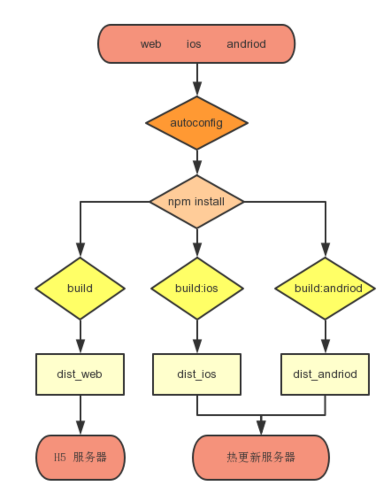

# 背景
对于微信分享，wap站等外接需求，由于没有RN-SDK支持，所以只能以纯web方式运行，那么如果我们可以把RN版本的代码编译为web版，就可以实现一套代码跑在三端，即可以提高性能，又可极大的节省人力成本。

# 设计
三端一套代码的最核心需求就是把RN代码转成react代码
- 基于react-native-web库，react-native-web提供了大部分RN组件的web版本，具有相同的组件名和api
- 利用webpack打包的别名功能，在打包web版时，用react-native-web替换react-native实现第一步组件的替换
- 对于react-native-web不支持的RN组件，和一些第三方RN组件，搭建组件库chameleon，参照上面的替换方法，在RN代码中使用chameleon/native，而打web包时则替换为chameleon/web

别名
```javascript
resolve: {
    alias: {
        'chameleon/native': 'chameleon/web',
    },
}
```

# 发布流程

打包脚本
```json
"scripts": {
    "start": "node node_modules/react-native/local-cli/cli.js start --reset-cache",
    "build": "webpack ...",
    "build:ios": "npm run make:version && node package.js ios -s",
    "build:android": "npm run make:version && node package.js android -s"
},
```
> -s 表示拆包

# 客户端
APP启动时，拉取最新项目列表，以 projectId，versionId 判断是否需要更新
> 拆包时，也是以 projectId + versionId 作为key，和bridge建立映射关系

# 开发
### 引入组件库的方式
由于业务代码中需要大量引用组件库，为了集中统一管理，在/common/chameleonLib.js中统一引入组件。做相应的封装再export出去，业务代码中一律从chameleonLib.js中import, 好处是，组件库升级时方便更新
```js
importConfigfrom'../config';
import{ PaApi, PaUtil, PaRouter, ScrollableTabView} from 'chameleon/native';
export{ PaApi, PaUtil, PaRouter, ScrollableTabView} from 'chameleon/native';

var assign= require('object-assign');

// API接口调用方法
export function paRequest(params,level) {
    constbody = assign({}, params, { _st:level, _api:Config.API});
    return PaApi.request(body).catch((error) =>{
        errorHandler(error);
    });
}

function errorHandler(error) {
    console.log(error);
}
```

### 路由
##### 和react-navigation的区别
- PaRouter组件本质上只是提供了页面跳转方法，以堆栈方式打开页面，相当于H5中的多页面应用方式，故页面间不共享store
- react-navigation相当于单页面应用，页面间共享store，但是采用react-navigation即相当于放弃转web版

##### web版编译
方法|	跳转到|	web版是否支持|	web版处理方式
-- | -- | -- | --
transitionTo|	RN页面（应用内）|	支持|	根据web版路由表匹配
transitionTo|	RN页面（跨应用）|	支持|	额外传递url参数
transionToNative|	Native页面|	不支持	|
transionToWebview|	H5页面	支持|	直接url跳转|

由上表可见，对于有编译web版需求的RN应用，使用PaRouter组件时，必须提供web版路由表，这样PaRouter才能在转为web版后，正确的保持应用内的跳转关系。

web版路由表
```javascript
import EvaList from'../../containers/evaList.react';
import ListContainer from'../../containers/List/listContainer.react';
import DetailContainer from'../../containers/Detail/detailContainer.react';

const routes= [{
    name: ListContainer.name,
    component: ListContainer,
    path: '/'
},{
    name: DetailContainer.name,
    component: DetailContainer,
    path: '/detail/:id'
},{
    name: EvaList.name,
    component: EvaList,
    path: '/eva(/:id)',
}];

export default routes;
```

路由表的使用
```javascript
import{ PaRouter} from'./common/chameleonLib';
const Router= PaRouter.Router;
import routes from'./web/src/routes';

PaRouter.registRoutes(routes);
render( <Router routes={routes}/>, document.getElementById('react-root'));
```