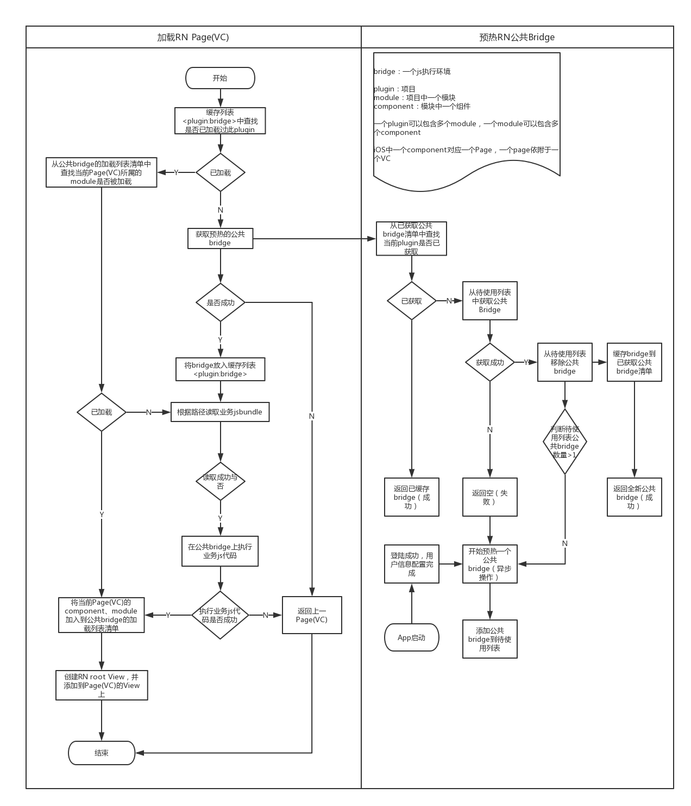

# 1、拆包
### 1.1、背景
在一个完整的jsbundle中，包含大约500k的RN源码；在RN业务变多以后，每个jsbundle中都有重复的RN源码带来两个坏处
- 安装包体积增大
- 加载RN应用时，浪费时间在执行公共JS代码上
### 1.2、解决思路
- 将react和react-native源码打成一个单独的公包common.android.jsbundle，同时生成一个描述文件common.android.json；
- 打业务包时，依据公包描述文件，从业务包中剔除公包中已经包含的依赖库，打出业务包
- APP启动时先预执行公包代码，准备好RN上下文；进入RN应用时将业务包在之前准备好的RN上下文上执行

# 2、技术细节
###  2.1、打公包
首先新建两个库

- 公包库：git@10.0.128.104:h5_base/common-rn.git
    > 入口文件只引react和react-native，以此打出的包，即为公包
- react-native源码fork库：git@10.0.128.104:h5_base/react-native.git
    > 增加打描述文件的功能，被common-rn依赖

主要修改内容如下:
目录 | 修改内容 | 作用
-- | -- | --
`packger/src/Bundler/Bundle.js` | 新增`getManifest`方法 | 根据module信息生成描述信息
`local-cli/bundle/output/bundle.js` | 在`saveBundleAndMap`中调用`getManifest`方法 | 输出描述文件

生成描述文件，包含依赖库的名称，id和源码hash，结构如下：
```json
{
    "modules": {
        "0f09738e920d4e99bda2a4d214861139": {
            "id": 0,
            "name": "common-rn/index.android.js"
        },
        "3c705474d87ac8a9b47623a9c3833989": {
            "id": 12,
            "name": "react/index.js"
        },
        ​
        ...
        ​
        "48b2c0a2e2c5bcd4da946e6956c12731": {
            "id": 360,
            "name": "VibrationIOS"
        },
        "0eb46b1c8f847a1efef0f1a537acc9ce": {
            "id": 361,
            "name": "takeSnapshot"
        }
    },
    "lastId": 361
}
```
### 2.2、打业务包
打业务包的核心就是剔除公包已经包含的代码，首先要了解`react-native/packager`的打包逻辑：

RN的打包逻辑
- 扫描依赖，组装依赖库对象
    > 根据packager/src/lib/ModuleTransport.js的对象模型组装
- 补齐依赖库对象中的id属性
    > 调用packager/src/Bundler/index.js中createModuleIdFactory方法
- 生成打包文件

我们的切入点主要在第2步 

- 给依赖库对象增加hash属性，由sourceCode生成
- 公包描述文件存储在manifest目录，并读取放置到_externalModules对象中
- 通过打包命令传入start-id，业务包id从此开始，避免id和公包重复

最终打出的业务包如下：
```json
{
    "modules": {
        "336e2c8b04fdd3b8de259f0913e21b50": {
            "id": 1000,
            "name": "eva-rn/index.android.js"
        },
        "28aa2f6d0f0220bc0276465658ba1191": {
            "id": 1012,
            "name": "fbjs/lib/warning.js"
        },
        "b757d4c38e4b1331521c6536c834eac3": {
            "id": 1013,
            "name": "eva-rn/containers/List/listContainer.react.js"
        },
        ​
        ...
        ​
        "34b49cc9f442352cc078eed39af5ad96": {
            "id": 1074,
            "name": "eva-rn/styles/Applink/style.react.js"
        }
    },
    "lastId": 1074
}
```
使用：打包命令中，增加-s参数
```shell
"build:ios": "npm run make:version && node package.js ios -s"
```

# 3、预热
### 3.1、方案原理
- js打包是将整个bundle包分别打包成common bundle和biz bundle。
- Native在加载RN页面之前，事先预热一个执行过common bundle代码的js执行上下文（bridge）。
- 在加载页面前使用预热的bridge上下文直接执行biz bundle代码，节省读取、执行common bundle部分js代码的时间，以优化RN页面首次加载的速度。 
> 参考过业界分享的预热方法，一般是先通过加载公共bundle包，构建一个Fake App，等加载完业务bundle包后，返回这个包的索引（id），然后添加指定component到Fake App的页面中进行渲染。由于require方法只支持number类型，参数的传递存在限制。 
经过分析js代码的执行逻辑，测试并确定了以native进行直接加载、渲染业务包的方案。Native事先加载公共bundle包，预热一个js执行上下文（bridge），等加载RN页面的时候，获取这个上下文，直接进行业务包的加载、执行，然后初始化RN root view，进行直接渲染，页面的渲染不再需要通过js进行触发。

### 3.2、流程描述
- App启动时，用户登陆成功、配置完用户信息；
- 预先加载、执行一个common bundle，构建一个bridge，放入公共bridge待使用清单；
- 当RN页面加载的时，先从公共bridge获取列表中查找，查找成功转5，查找失败转3；
- 获取公共brige，以页面的plugin+version作为key构建映射关系，放入公共bridge获取清单，并执行2；
- 用获取到的bridge直接执行biz bundle的js代码，然后
- 加载页面，并将页面的module、component加入到bridge的加载页面清单；
- 初始化RN root view，添加到当前页面(VC)，进行渲染；
- 页面销毁时，从bridge加载页面清单中移除，并判断当前bridge是否已移除所有加载页面，是转8，否结束；
- 从公共bridge获取清单中，移除bridge，然后销毁bridge； 


### 3.3、公共bridge及加载页面清单映射关系结构
整个映射关系映射成一个两层key-value和一层list的结构：<string, > 
公共bridge及加载页面映射关系结构 Collapse source

├── eva-700
│   └── index
│       ├── EvaluationDetail
│       └── ListContainer
└── plugin-version
    ├── moduleA
    │   ├── component1
    │   ├── component2
    │   ├── component3
    │   ├── component4
    │   └── component5
    └── moduleB
        ├── component1
        ├── component2
        ├── component3
        └── component4 