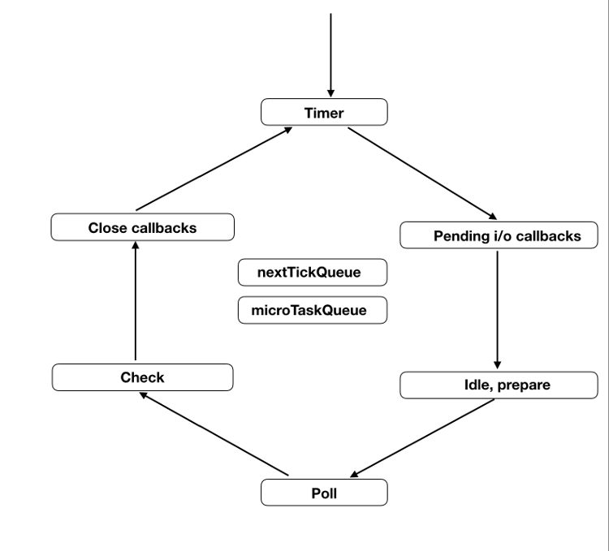

# Node事件循环


```javascript
// test.js
setTimeout(() => console.log(1));
setImmediate(() => console.log(2));
process.nextTick(() => console.log(3));
Promise.resolve().then(() => console.log(4));
(() => console.log(5))();

// 5, 3, 4, 1, 2
```

# 参见
- [Javascript异步的底层原理 - 博客园](https://www.cnblogs.com/chenjun1/p/11682004.html)
- [Node定时器 - 阮一峰](https://www.ruanyifeng.com/blog/2018/02/node-event-loop.html)
- [JS是单线程，你了解其运行机制吗 - segmentfault](https://segmentfault.com/a/1190000015806981)