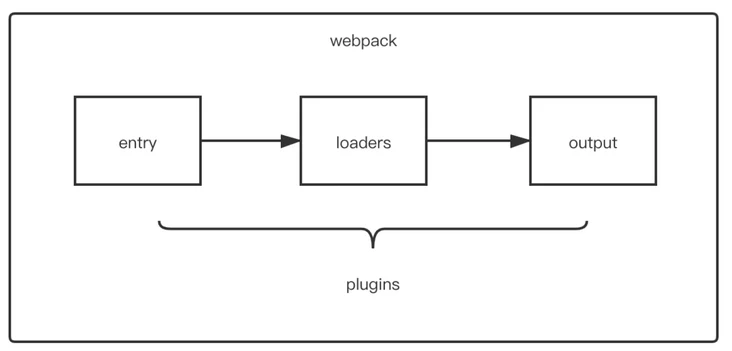

# 介绍


### 场景loader

### 常见plugin
- ignore-plugin：忽略部分文件
- html-webpack-plugin：简化 HTML 文件创建 (依赖于 html-loader)
- webpack-parallel-uglify-plugin: 多进程执行代码压缩，提升构建速度
- mini-css-extract-plugin: 分离样式文件，CSS 提取为独立文件，支持按需加载 (替代extract-text-webpack-plugin)
- serviceworker-webpack-plugin：为网页应用增加离线缓存功能
- clean-webpack-plugin: 目录清理
- ModuleConcatenationPlugin: 开启 Scope Hoisting
    > 模块打到一起，节省函数调用（非es6模块和异步引入的还是通过 webpack.require方式互相引用）
- speed-measure-webpack-plugin: 可以看到每个 Loader 和 Plugin 执行耗时 (整个打包耗时、每个 Plugin 和 Loader 耗时)
- webpack-bundle-analyzer: 可视化 Webpack 输出文件的体积 (业务组件、依赖第三方模块)

# 自定义loader
```javascript
// 导出一个函数，source为webpack传递给loader的文件源内容
module.exports = function(source) {
    const content = doSomeThing2JsString(source);
    
    // 如果 loader 配置了 options 对象，那么this.query将指向 options
    const options = this.query;
    
    // 可以用作解析其他模块路径的上下文
    console.log('this.context');
    
    /*
     * this.callback 参数：
     * error：Error | null，当 loader 出错时向外抛出一个 error
     * content：String | Buffer，经过 loader 编译后需要导出的内容
     * sourceMap：为方便调试生成的编译后内容的 source map
     * ast：本次编译生成的 AST 静态语法树，之后执行的 loader 可以直接使用这个 AST，进而省去重复生成 AST 的过程
     */
    this.callback(null, content); // 异步
    return content; // 同步
}
```

# 自定义plugin
```javascript
class MyPlugin {
    // Webpack 会调用 MyPlugin 实例的 apply 方法给插件实例传入 compiler 对象
  apply (compiler) {
    // 找到合适的事件钩子，实现自己的插件功能
    compiler.hooks.emit.tap('MyPlugin', compilation => {
        // compilation: 当前打包构建流程的上下文
        console.log(compilation);
        
        // do something...
    })
  }
}
```

# 优化分析
- speed-measure-webpack-plugin
- perf_hooks
- webpack-bundle-analyzer

# 优化手段
- 移除检查代码
- CDN
- 升级插件

### CDN
将常用库改为cdn引入

在public/index.html中添加
```html
<link
    href="//cdn.bootcdn.net/ajax/libs/antd/4.3.4/antd.min.css"
    rel="stylesheet"
/>

<script src="//cdn.bootcdn.net/ajax/libs/react/16.12.0/umd/react.production.min.js"></script>

<script src="//cdn.bootcdn.net/ajax/libs/react-dom/16.12.0/umd/react-dom.production.min.js"></script>

<script src="//cdn.bootcdn.net/ajax/libs/redux/4.0.5/redux.min.js"></script>

<script src="//cdn.bootcdn.net/ajax/libs/lodash.js/4.17.15/lodash.min.js"></script>

<script src="//cdn.bootcdn.net/ajax/libs/moment.js/2.27.0/moment.min.js"></script>
<script src="//cdn.bootcdn.net/ajax/libs/moment.js/2.27.0/locale/zh-cn.min.js"></script>

<script src="//cdn.bootcdn.net/ajax/libs/antd/4.3.4/antd-with-locales.min.js"></script>
```

webpack
```js
const useExternal = config => {
    config.externals = {
        react: 'React',
        'react-dom': 'ReactDOM',
        redux: 'Redux',
        lodash: '_',
        moment: 'moment',
        'moment/locale/zh-cn': 'moment.locale',
        antd: 'antd',
    };

    return config;
};

module.exports = override(useExternal);
```

### 移除检查代码
- Package.json校验
- TS配置校验
- 入口文件检测
- browserList校验
- 文件大小校验

# 参照
- [react-scripts流程及源码分析 - 掘金](https://juejin.cn/post/6844903951893004296)
- [webpack常见面试题总结 - segmentfault](https://segmentfault.com/a/1190000041100811)