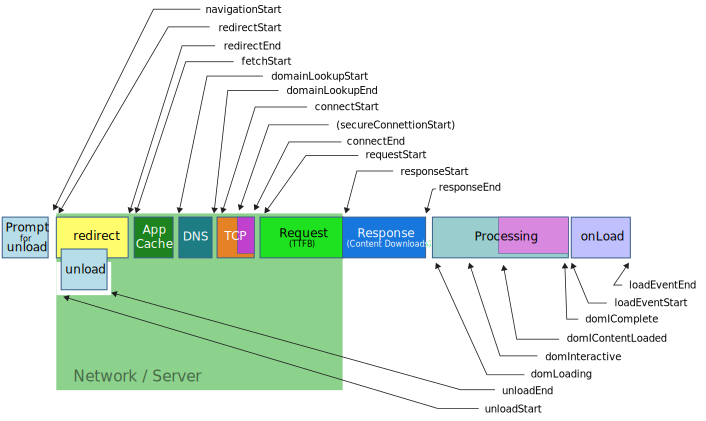
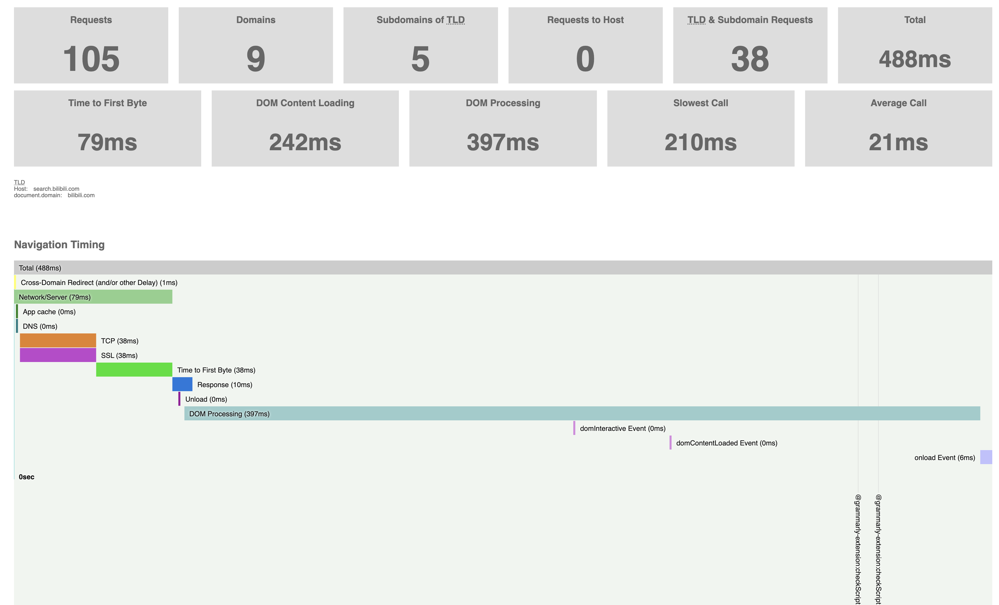

# 时间节点

流程
- redirect
- cache
- dns
- tcp
- request(ttfb)
- response
- processing
    - domInteractive
    - domContentLoaded(domy已经加载完毕，但是js和图片还在loading, 直到domComplete)
- onload

# 实例

# 参见
- [calculate page load times using performance timing - stackoverflow](https://stackoverflow.com/questions/58054543/calculate-page-load-times-using-javascripts-window-performance-timing)