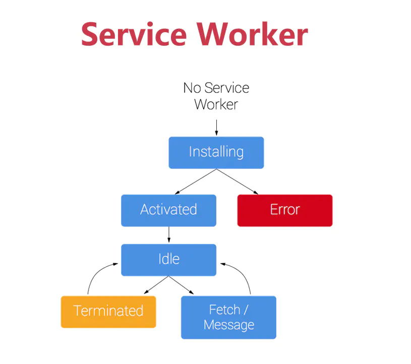

# 介绍
离线访问网页


缺点
- 页面加载时才去拉取新版本，需要刷新页面
- 侵入代码

# workbox
对ServiceWorker做了一层封装，可以很容易的选择请求不同资源对应的策略
```javascript
// 缓存优先
workbox.routing.registerRoute(
  /\.(png|jpg|jpeg|gif|webp)$/,
  // 对于图片资源使用缓存优先
  workbox.strategies.cacheFirst({
    cacheName: 'images',
    // 设置最大缓存数量以及过期时间
    plugins: [
      new workbox.expiration.Plugin({
        maxEntries: 60,
        maxAgeSeconds: 7 * 24 * 60 * 60,
      }),
    ],
  }),
);

// 第一次网络，后续缓存
workbox.routing.registerRoute(
  /\.(js|css)$/,
  workbox.strategies.staleWhileRevalidate({
    cacheName: 'css.js',
  }),
);
```

# 参见
- [用 Service Worker 实现前端性能优化 - segmentfault](https://segmentfault.com/a/1190000015350831)
- [service worker - alvinhtml](http://note.alvinhtml.com/web/service-worker.html)