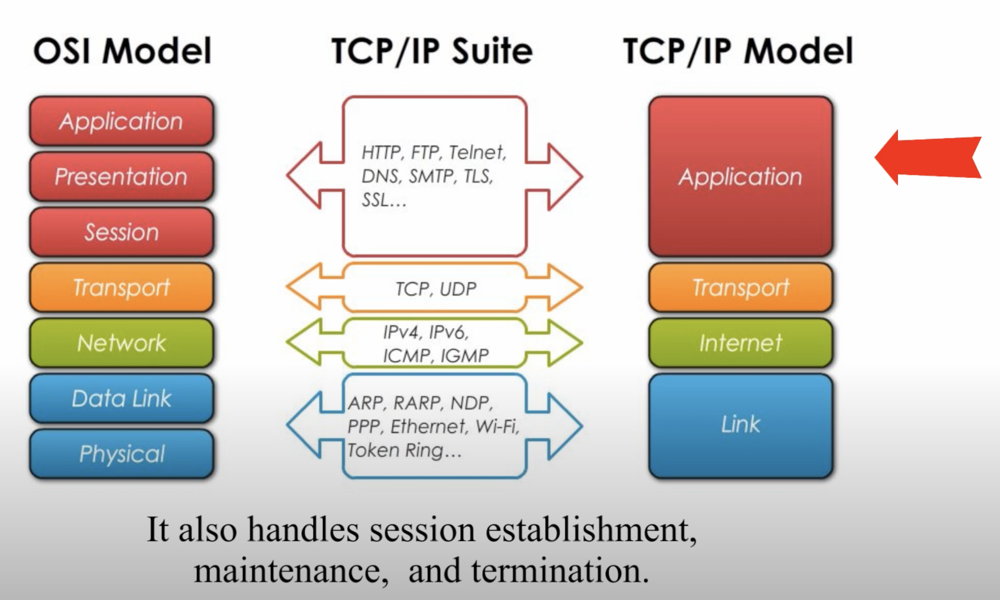
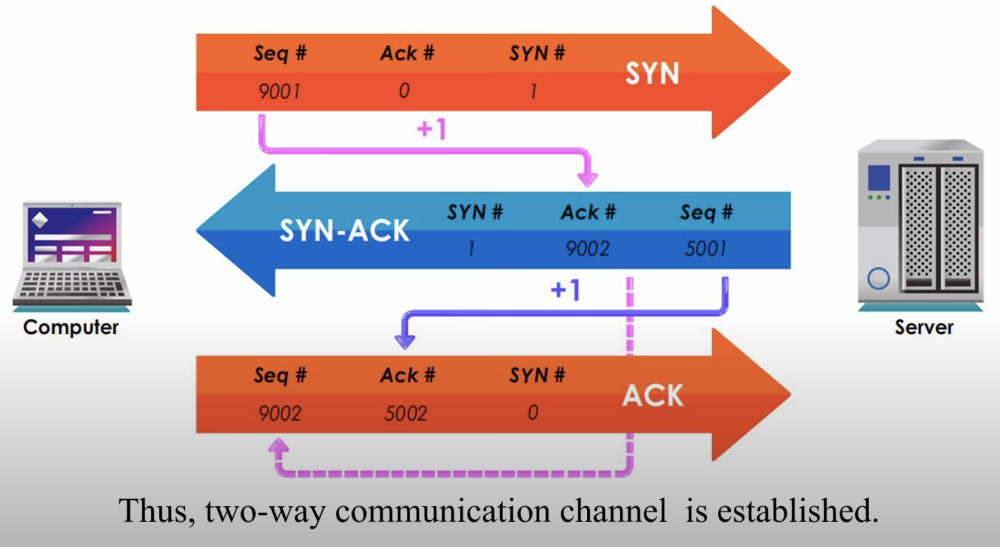
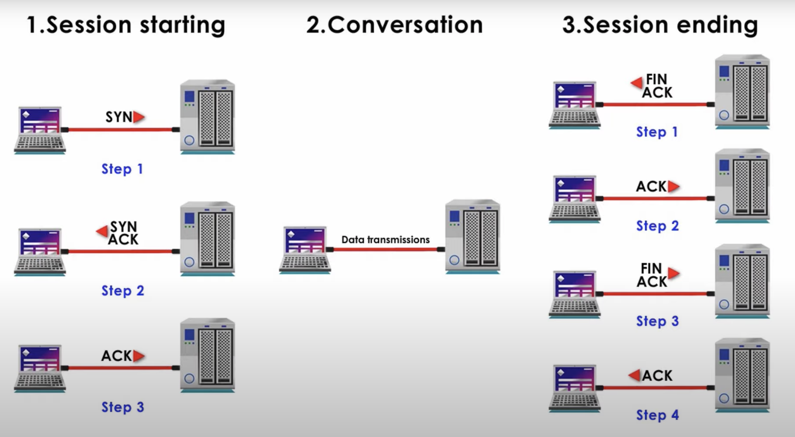
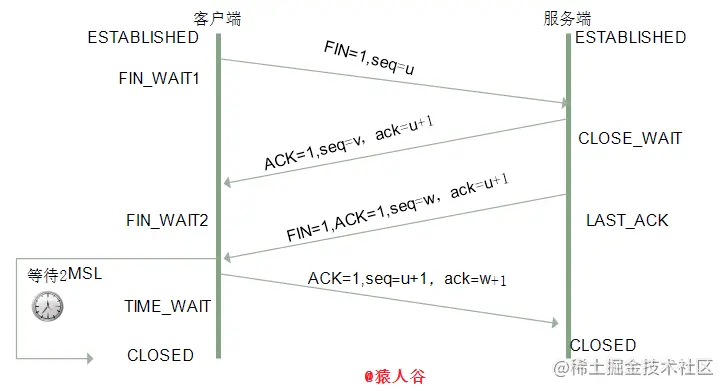

# 网络模型
OSI七层网络模型 | TCP/IP四层概念模型 | 网络协议
-- | -- | -- 
应用层(Application) | 应用层 | HTTP 
表示层(Presentation) | 应用层 | ASCII 
会话层(Session) | 应用层 | Socket 
传输层(Transport) | 传输层 | TCP 
网络层(Network) | 网络层 | IP
数据链路层(Data Link) | 链路层 | - 
物理层(Physical) | 链路层 | -

- 应用层
    - 压缩，加密，session管理
    - http，ftp,telnet,dns,smtp,tls,ssl
- 传输层
    - 数据分片，flow control，错误处理
    - tcp, udp
- 网络层
    - ip寻址，ip路由
    - ipv4, ipv6, 
- 链路层
    - mac寻址，物理线缆
    - wifi

# TCP三次握手

握手信息
- seq
- ack（针对seq的响应，seq + 1）
- syn（是否需要建立连接）

### syn攻击
SYN攻击就是Client在短时间内伪造大量不存在的IP地址，并向Server不断地发送SYN包，Server则回复确认包，并等待Client确认，由于源地址不存在，因此Server需要不断重发直至超时，这些伪造的SYN包将长时间占用未连接队列，导致正常的SYN请求因为队列满而被丢弃，从而引起网络拥塞甚至系统瘫痪。SYN 攻击是一种典型的 DoS/DDoS 攻击。
- 缩短超时（SYN Timeout）时间
- 增加最大半连接数
- 过滤网关防护
- SYN cookies技术

# 四次挥手

- 步骤一的ack用于确认最近一次发来的数据包

- close_wait等待数据发送完
- time_wait用于防止最后一次ack丢失，暂时不关闭等待服务端重试

# 参见
- [tcp三次握手 - youtube](https://www.youtube.com/watch?v=xMtP5ZB3wSk)
- [面试官，不要再问我三次挥手和四次握手 - 掘金](https://juejin.cn/post/6844903958624878606)