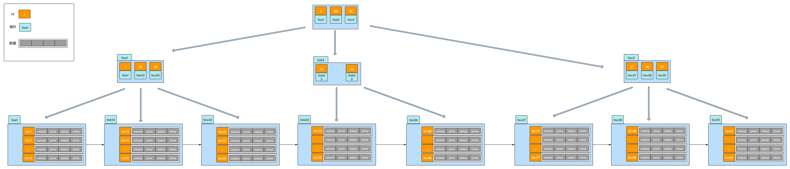
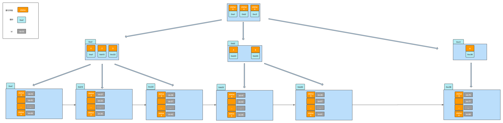

# 索引种类
- 聚簇索引（叶子节点 = 索引 + 行数据）
- 二级索引（叶子节点 = 索引 + 主键ID）

# 聚簇索引（Cluster Index）
- 如果表定义了主键，则主键就是聚集索引；
- 如果表没有定义主键，则第一个非空唯一索引（not NULL unique）列是聚集索引；
- 否则，InnoDB会创建一个隐藏的row-id作为聚集索引；


# 二级索引（Secondary Index）


# 回表
查询时使用二级索引先查询到数据行的主键id, 再回到聚簇索引中根据id查到真实的数据行, 这个过程叫做回表;
```sql
select * from ex_order_btcusdt where status = 2;
```
此处先通过二级索引查到stauts=2的数据行的主键id, 然后再通过主键id 回到聚簇索引表中查到真实的数据行;

# 索引覆盖
避免回表的手段。比如根据name查age的需求很多，那么我们可以建立name_age_index联合索引，由于联合索引中直接包含了age，则无须再回表
> 注意联合中的最左匹配原则，如果建立的是age_name_index，则不会触发索引
```sql
SELECT age FROM student WHERE name = '小李'；
```

# 参见
https://juejin.cn/post/6844903967365791752
http://foxofcan.com/2021/06/18/index_something/