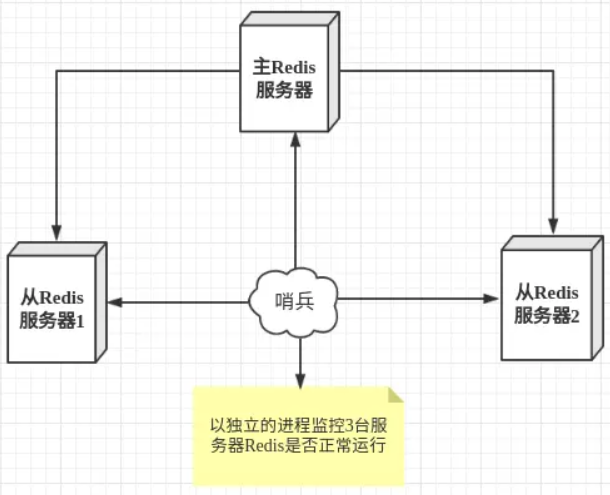

# 三种集群模式
- 主从
- 哨兵（Sentinel）
- Cluster

# 主从

介绍
- 读写分离，分担 "master" 的读写压力
- 方便做容灾恢复

缺点
- Redis不具备自动容错和恢复功能，任意主从的宕机都会导致前端读写失败，需要人工介入
- 主机宕机还会有数据不一致问题
- Redis 较难支持在线扩容，在集群容量达到上限时在线扩容会变得很复杂；

# 哨兵模式

介绍
- 加强版的主从
- 当哨兵监测到 master 宕机，会自动将 slave 切换成 master ，然后通过发布订阅模式通知其他的从服务器，修改配置文件，让它们切换主机；
- 哨兵本身也可以是多个，用投票决定是否切换master；或者下线slaver

缺点
- Redis较难支持在线扩容，在集群容量达到上限时在线扩容会变得很复杂。

# Cluster模式

介绍
- 任何两个节点都是互通的
- 每个节点存储的数据不同
- 客户端可以访问集群的任一节点
- 使用`hash slot`的方式，所有节点分16384个槽位，增加或者删除节点，只需移动槽位
- 为了保证高可用，每个节点本身是主从的
- 每个节点都有一个cluster集群管理插件，负责寻槽
> 和K8s的思路很类似

### 一致性hash
Cluster使用哈希槽而没有使用一致性hash算法，那么什么是一致性hash呢？

首先要了解一下普通hash

> 在集群模式下增删节点，如果使用普通hash，会需要移动大量数据，造成缓存雪崩，比如上图删除test节点

一致性hash使用hash环的方式

> k* 对象，顺时针方向寻找最近的服务器 t*

# 参见
- [redis集群](https://segmentfault.com/a/1190000022808576)
- [一致性hash](https://segmentfault.com/a/1190000021199728)